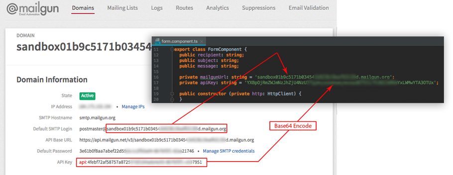

# NativeScript for Angular: Send Emails with Mailgun


*Demo apps*

The [Mailgun](https://www.mailgun.com/) is a Email Service for Developers, which includes a free tier, for sending emails via a RESTful API. No need for users to configure their email client and no need to maintain an email inbox.

To make things easy to understand, we’re going to start a fresh NativeScript Angular project. From the Terminal (Linux and Mac), execute the following:

```
$ tns create ns-ng-MailGun --ng
$ cd ns-ng-MailGun
$ tns platform add ios
```

## The NativeScript Angular and TypeScript Logic

Starting with the **app/module.ts** file, open it and include the following TypeScript code:

```angular2html
import { NgModule, NO_ERRORS_SCHEMA } from '@angular/core';
import { HttpClientModule } from '@angular/common/http';
import { NativeScriptModule } from 'nativescript-angular/nativescript.module';
import { NativeScriptFormsModule, NativeScriptHttpModule } from 'nativescript-angular';
import { AppRoutingModule } from './app.routing';
import { AppComponent } from './app.component';
import { FormComponent } from './form/form.component';

@NgModule({
  bootstrap: [
    AppComponent
  ],
  imports: [
    HttpClientModule,
    NativeScriptModule,
    NativeScriptFormsModule,
    NativeScriptHttpModule,
    AppRoutingModule
  ],
  declarations: [
    AppComponent,
    FormComponent
  ],
  providers: [],
  schemas: [
    NO_ERRORS_SCHEMA
  ]
})

export class AppModule {
}
```

In reality, I’ve only included two things that are different from the default template. The goal here was to include the 
`NativeScriptFormsModule` and the `NativeScriptHttpModule` so that we can make HTTP requests and bind data to UI input fields.
And also deleted the folder **item** and reconfigured **app.routing.ts**.

Now we can focus on the bulk of our application. Open the project’s **app/form/form.component.ts** file and include the following TypeScript code:

```angular2html
import { Component } from '@angular/core';
import { HttpClient, HttpHeaders } from '@angular/common/http';
import 'rxjs/Rx';

@Component({
  selector: 'ns-form',
  moduleId: module.id,
  templateUrl: './form.component.html',
})
export class FormComponent {
  public recipient: string;
  public subject: string;
  public message: string;

  private mailgunUrl: string = 'MAILGUN_URL_HERE';
  private apiKey: string = 'BASE64_API_KEY_HERE';

  public constructor (private http: HttpClient) {
  }

  private get headers () {
    return new HttpHeaders(
      {
        'Content-Type': 'application/x-www-form-urlencoded',
        'Authorization': 'Basic ' + this.apiKey
      }
    );
  }

  public send () {
    if (this.recipient && this.subject && this.message) {
      this.http.post(
        'https://api.mailgun.net/v3/' + this.mailgunUrl + '/messages',
        'from=test@example.com&to=' + this.recipient + '&subject=' + this.subject + '&text=' + this.message,
        { headers: this.headers }
      )
        .map(result => JSON.stringify(result))
        .do(result => console.log('RESULT: ', JSON.stringify(result)))
        .subscribe(result => {
          console.log('SENT!', result);
          this.recipient = '';
          this.subject = '';
          this.message = '';
        }, error => {
          console.log(error);
        });
    }
  }
}
```

There is a lot going on in the above code so we’re going to break it down piece by piece.

```angular2html
import { Component } from '@angular/core';
import { HttpClient, HttpHeaders } from '@angular/common/http';
import 'rxjs/Rx';
```
We need to import `HttpClient` along with `HttpHeaders` because we’ll be making an HTTP post request to the Mailgun API. 
This request will require certain headers to be set, otherwise the request will be rejected by Mailgun. HTTP requests in 
Angular are not very powerful unless you include [RxJS](https://github.com/Reactive-Extensions/RxJS) with them.

Inside our `FormComponent` class we have various private and public variables.

```angular2html
public recipient: string;
public subject: string;
public message: string;
private mailgunUrl: string = 'MAILGUN_URL_HERE';
private apiKey: string = 'BASE64_API_KEY_HERE';
```

The public variables will be bound to input fields within the application UI. 
What is most important here is the `mailgunUrl` and the `apiKey` variables. 
It is critical you get these correct. The URL and API key can be found in your Mailgun administrative dashboard. 
However, the API key must be formatted before it can be used.

When you obtain your API key it should look something like `API Key: 4febf72af58757a8...`. 
Your entire key, including `api:` needs to be base64 encoded. 
You can encode the API key using the website [Base64 Encode](https://www.base64encode.org/).



> Or you can take advice [How to base64 encode a string in NativeScript](https://discourse.nativescript.org/t/how-to-base64-encode-a-string-in-nativescript/345):
add two npm packages to your NativeScript project: 
```
$ npm install base-64 --save
$ npm install utf8 --save
```
> TypeScript
```angular2html
import * as  base64 from "base-64";
import * as utf8 from "utf8";
```
> Then in your code:
```angular2html
var str = "myfancystring";
var bytes = utf8.encode(str);
var encodedStr = base64.encode(bytes);
console.log(encodedStr);
```

Before we can make HTTP requests, the `HttpClient` component needs to be injected into the `constructor` method of the class.

Finally we have the `send` method and public variable `headers`:
```angular2html
  private get headers () {
    return new HttpHeaders(
      {
        'Content-Type': 'application/x-www-form-urlencoded',
        'Authorization': 'Basic ' + this.apiKey
      }
    );
  }

  public send () {
    if (this.recipient && this.subject && this.message) {
      this.http.post(
        'https://api.mailgun.net/v3/' + this.mailgunUrl + '/messages',
        'from=test@example.com&to=' + this.recipient + '&subject=' + this.subject + '&text=' + this.message,
        { headers: this.headers }
      )
        .map(result => JSON.stringify(result))
        .do(result => console.log('RESULT: ', JSON.stringify(result)))
        .subscribe(result => {
          console.log('SENT!', result);
          this.recipient = '';
          this.subject = '';
          this.message = '';
        }, error => {
          console.log(error);
        });
    }
  }
```

Inside the `send` method we confirm that our form variables have data in them. 
If they have data we can define our request headers. 
Per the Mailgun API documentation we need to have an `Authorization` header and a `Content-Type` of `x-www-form-urlencoded`. 

Notice that the `body` of the request is ampersand delimited, not a JavaScript object. 
It is very important because we’re using `x-www-form-urlencoded`.

When we send the request, we can transform the response using RxJS and reset the form after subscribing to the observable created.

Now let’s focus on the UI of this application.

## The NativeScript UI for the Mailgun Application

The UI we create will be very simple, but it will get the job done. 
Open the project’s **app/form/form.component.html** file and include the following markup:

```html
<ActionBar>
  <ActionItem text="Send" ios.position="right" (tap)="send()"></ActionItem>
</ActionBar>

<StackLayout class="form">
  <StackLayout class="input-field"><Label class="label" text="Recipient (To):"></Label>
    <TextField class="input input-border" [(ngModel)]="recipient" autoCapitalizationType="none"></TextField>
  </StackLayout>
  <StackLayout class="input-field"><Label class="label" text="Subject:"></Label>
    <TextField class="input input-border" [(ngModel)]="subject"></TextField>
  </StackLayout>
  <StackLayout class="input-field"><Label class="label" text="Message:"></Label>
    <TextField class="input input-border" [(ngModel)]="message"></TextField>
  </StackLayout>
</StackLayout>
```
Inside the action bar we have a button that when clicked will trigger the `save` method that is found in our TypeScript code. 
Each of the form inputs has a `[(ngModel)]` tag which creates a two way data binding with the public variables that we also defined in the TypeScript code. 
This allows us to accept user input via the form and manipulate the input via our TypeScript.

At this point the application should be ready to go.

## If you want to use a ready-made project

> Make sure that you have NativeScript version ≥2.5 and Xcode. Please see instructions for [installing the NativeScript](https://github.com/Amaster-eu/Install-NativeScript).

This repository includes NativeScript app only for iOS platform. In order to run those execute the following in your shell:

```
$ git clone https://github.com/Amaster-eu/ns-ng-MailGun
$ cd ns-ng-MailGun
$ npm install
$ tns run ios
```
